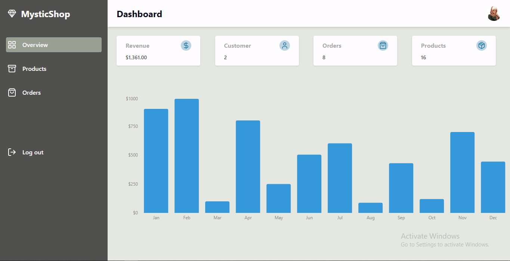

<p align="center">
  <h1 align="center">
    Mystic Shop Dashboard 
  </h1>
</p>

## Description

The dashboard of an online decor marketplace where users can discover and purchase a wide range of home decor items. The platform also empowers sellers to showcase and sell their unique products, fostering a diverse community of decor enthusiasts and creators.

#### [Project Link](https://mystic-shop-dashboard.vercel.app/)

## About The Project

### Preview



## Table of Contents

- [Features](#features)
- [Technologies](#technologies)
- [Getting Started](#getting-started)

## Features

- [x] User authentication with Clerk
- [x] Seller profile creation 
- [x] Product Detail Upload


## Technologies

- React.js
- Redux
- MongoDB
- Clerk
- Prisma
- React Hook Form
- Tailwind css
- React Hot Toast

## Getting Started

This is an example of how you may give instructions on setting up your project locally.
To get a local copy up and running follow these simple example steps.

### Prerequisites

Before running the application, make sure you have the following installed:

- Node.js

### Installation

1. Clone the repository

```bash
https://github.com/balikis-oyeleye/MysticShop-Dashboard.git
```
2. Go to the project directory and install dependencies 

```bash
npm install
```

3. Enter your API in `.env file`
```bash
NEXT_PUBLIC_CLOUDINARY_CLOUD_NAME=YOUR API KEY
NEXT_PUBLIC_CLERK_PUBLISHABLE_KEY=YOUR API KEY
CLERK_SECRET_KEY=YOUR API KEY
NEXT_PUBLIC_CLERK_SIGN_IN_URL=/sign-in
NEXT_PUBLIC_CLERK_SIGN_UP_URL=/sign-up
NEXT_PUBLIC_CLERK_AFTER_SIGN_IN_URL=/
NEXT_PUBLIC_CLERK_AFTER_SIGN_UP_URL=/
DATABASE_URL=YOUR API KEY
```


